# CareerPilot AI - Agentic Workflow System

> Multi-Agent LLM Council with LangGraph Orchestration

---

## Table of Contents

1. [Architecture Overview](#1-architecture-overview)
2. [LangGraph Fundamentals](#2-langgraph-fundamentals)
3. [Base Agent Implementation](#3-base-agent-implementation)
4. [Master Agents](#4-master-agents)
5. [Helper Agents](#5-helper-agents)
6. [Workflow Definitions](#6-workflow-definitions)
7. [Decision Engine](#7-decision-engine)
8. [Message Bus](#8-message-bus)
9. [Prompt Templates](#9-prompt-templates)
10. [Error Handling & Escalation](#10-error-handling--escalation)
11. [Cost Optimization](#11-cost-optimization)

---

## 1. Architecture Overview

### Agent Hierarchy

```mermaid
graph TB
    subgraph Orchestrator["🎯 ORCHESTRATOR LAYER"]
        SM["State Machine<br/>(LangGraph)"]
        DE["Decision Engine"]
        MB["Message Bus"]
    end
    
    subgraph Masters["🧠 MASTER AGENTS (Expensive)"]
        ST["Strategist<br/>Gemini Pro<br/>$0.05/call"]
        EV["Evaluator<br/>Flash Think<br/>$0.02/call"]
        RS["Resolver<br/>Gemini Pro<br/>$0.05/call"]
    end
    
    subgraph Helpers["⚡ HELPER AGENTS (Fast & Cheap)"]
        EX["Extractor<br/>Flash Lite<br/>$0.001"]
        GN["Generator<br/>Flash 2.5<br/>$0.01"]
        VL["Validator<br/>Flash Lite<br/>$0.0005"]
        FM["Formatter<br/>Flash Lite<br/>$0.0005"]
    end
    
    SM --> DE
    DE --> MB
    MB --> ST
    MB --> EV
    MB --> RS
    
    ST --> EX
    ST --> GN
    EV --> VL
    RS --> FM
```



### Agent Roles

| Agent | Type | Purpose | Model | Cost/Call |
|-------|------|---------|-------|-----------|
| **Strategist** | Master | Plans execution, handles ambiguity | Gemini 2.5 Pro | $0.05 |
| **Evaluator** | Master | Scores quality, approves/rejects | Flash Thinking | $0.02 |
| **Resolver** | Master | Conflicts, edge cases, final calls | Gemini 2.5 Pro | $0.05 |
| **Extractor** | Helper | Parse documents, extract data | Flash 2.0 Lite | $0.001 |
| **Generator** | Helper | Create content, plans | Flash 2.5 | $0.01 |
| **Validator** | Helper | Check facts, classify | Flash 2.0 Lite | $0.0005 |
| **Formatter** | Helper | Format output, convert | Flash 2.0 Lite | $0.0005 |

### Why This Architecture?

1. **Cost Efficiency**: Cheap helpers do 80% of work, expensive masters only when needed
2. **Quality Control**: Every output evaluated before delivery
3. **Resilience**: Failures escalate through 6 levels before giving up
4. **Maintainability**: Each agent has single responsibility
5. **Observability**: Full trace of decisions and handoffs

---

## 2. LangGraph Fundamentals

### What is LangGraph?

LangGraph is a library for building stateful, multi-actor applications with LLMs. It provides:

- **State Machines**: Define workflows as graphs with nodes and edges
- **Conditional Routing**: Dynamic decision-making based on state
- **Checkpointing**: Save and resume workflow state
- **Streaming**: Real-time updates as agents process

### Core Concepts

```python
from langgraph.graph import StateGraph, END
from typing import TypedDict, Annotated
from operator import add


# 1. Define State - What data flows through the graph
class WorkflowState(TypedDict):
    # Input
    resume_text: str
    target_role: str
    
    # Processing
    extracted_data: dict | None
    analysis_result: dict | None
    
    # Control
    current_agent: str
    retry_count: int
    errors: Annotated[list[str], add]  # Accumulates errors
    
    # Output
    final_response: dict | None
    status: str  # pending, processing, completed, failed


# 2. Define Nodes - Agent functions
async def extractor_node(state: WorkflowState) -> WorkflowState:
    """Extract structured data from resume."""
    # Agent logic here
    return {"extracted_data": {...}, "current_agent": "validator"}


# 3. Define Edges - Routing logic
def route_after_extraction(state: WorkflowState) -> str:
    if state.get("extracted_data"):
        return "validator"
    elif state["retry_count"] < 3:
        return "extractor"  # Retry
    else:
        return "resolver"  # Escalate


# 4. Build Graph
graph = StateGraph(WorkflowState)

# Add nodes
graph.add_node("extractor", extractor_node)
graph.add_node("validator", validator_node)
graph.add_node("resolver", resolver_node)

# Add edges
graph.add_edge("start", "extractor")
graph.add_conditional_edges(
    "extractor",
    route_after_extraction,
    {
        "validator": "validator",
        "extractor": "extractor",
        "resolver": "resolver",
    }
)
graph.add_edge("validator", END)

# Compile
workflow = graph.compile()
```

---

## 3. Base Agent Implementation

### Abstract Base Agent (app/agents/core/base_agent.py)

```python
from abc import ABC, abstractmethod
from typing import Any, TypeVar, Generic
from pydantic import BaseModel
from app.services.llm.gateway import LLMGateway
from app.models.agents import AgentRole
from loguru import logger

T = TypeVar("T", bound=BaseModel)


class BaseAgent(ABC, Generic[T]):
    """Abstract base class for all agents."""
    
    role: AgentRole
    model_tier: str  # "lite", "flash", "flash-thinking", "pro"
    max_retries: int = 3
    timeout_seconds: int = 30
    
    def __init__(self, llm: LLMGateway):
        self.llm = llm
        self.execution_count = 0
        self.total_tokens = 0
        self.total_cost = 0.0
    
    @abstractmethod
    def get_system_prompt(self) -> str:
        """Return the system prompt for this agent."""
        pass
    
    @abstractmethod
    def build_prompt(self, **kwargs) -> str:
        """Build the user prompt from inputs."""
        pass
    
    @abstractmethod
    def parse_response(self, response: str) -> T:
        """Parse LLM response into structured output."""
        pass
    
    async def execute(self, **kwargs) -> T:
        """Execute the agent task with retries."""
        self.execution_count += 1
        
        for attempt in range(self.max_retries):
            try:
                logger.info(f"{self.role.value}: Attempt {attempt + 1}")
                
                # Build prompt
                system = self.get_system_prompt()
                user_prompt = self.build_prompt(**kwargs)
                full_prompt = f"{system}\n\n{user_prompt}"
                
                # Call LLM
                result = await self.llm.generate(
                    prompt=full_prompt,
                    task=self._get_task_type(),
                    max_tokens=self._get_max_tokens(),
                )
                
                # Track usage
                self.total_tokens += result["tokens"]
                self.total_cost += result["cost"]
                
                # Parse response
                parsed = self.parse_response(result["text"])
                
                logger.info(f"{self.role.value}: Success")
                return parsed
                
            except Exception as e:
                logger.warning(f"{self.role.value}: Attempt {attempt + 1} failed: {e}")
                if attempt == self.max_retries - 1:
                    raise
        
        raise RuntimeError(f"{self.role.value} failed after {self.max_retries} attempts")
    
    def _get_task_type(self) -> str:
        """Map agent role to LLM task type for routing."""
        mapping = {
            AgentRole.STRATEGIST: "reason",
            AgentRole.EVALUATOR: "evaluate",
            AgentRole.RESOLVER: "resolve",
            AgentRole.EXTRACTOR: "extract",
            AgentRole.GENERATOR: "generate",
            AgentRole.VALIDATOR: "validate",
            AgentRole.FORMATTER: "format",
        }
        return mapping.get(self.role, "generate")
    
    def _get_max_tokens(self) -> int:
        """Get max tokens based on model tier."""
        return {
            "lite": 500,
            "flash": 2000,
            "flash-thinking": 2000,
            "pro": 4000,
        }.get(self.model_tier, 1000)
    
    def get_stats(self) -> dict:
        """Return execution statistics."""
        return {
            "role": self.role.value,
            "executions": self.execution_count,
            "total_tokens": self.total_tokens,
            "total_cost": self.total_cost,
        }
```

---

## 4. Master Agents

### Strategist Agent (app/agents/masters/strategist.py)

```python
from app.agents.core.base_agent import BaseAgent
from app.models.agents import AgentRole, StrategistOutput, ExecutionStep, Complexity
from pydantic import ValidationError
import json


class StrategistAgent(BaseAgent[StrategistOutput]):
    """Master agent for planning and complex reasoning."""
    
    role = AgentRole.STRATEGIST
    model_tier = "pro"
    max_retries = 2
    timeout_seconds = 60
    
    def get_system_prompt(self) -> str:
        return """You are The Strategist, a master planning agent.

Your responsibilities:
1. Analyze request complexity
2. Create execution plans
3. Handle ambiguous requests
4. Design fallback strategies

You coordinate helper agents (Extractor, Generator, Validator, Formatter).
Only create plans that can be executed by available agents.

ALWAYS respond in valid JSON matching this schema:
{
    "complexity": "simple" | "moderate" | "complex",
    "confidence": 0-100,
    "execution_plan": [
        {
            "step": 1,
            "agent": "extractor" | "generator" | "validator" | "formatter",
            "task": "description of task",
            "fallback_if": "condition for fallback" | null
        }
    ],
    "needs_clarification": true | false,
    "clarification_question": "question if needs_clarification is true" | null
}"""
    
    def build_prompt(
        self,
        request_type: str,
        user_input: str,
        context: dict | None = None,
    ) -> str:
        context_str = json.dumps(context) if context else "None"
        
        return f"""## Request Type
{request_type}

## User Input
{user_input}

## Context
{context_str}

## Instructions
1. Assess the complexity of this request
2. Create an execution plan using available helper agents
3. If the request is ambiguous, set needs_clarification to true
4. For each step, consider what could go wrong and set fallback_if

Respond with the JSON plan."""
    
    def parse_response(self, response: str) -> StrategistOutput:
        # Extract JSON from response
        try:
            # Handle markdown code blocks
            if "```json" in response:
                response = response.split("```json")[1].split("```")[0]
            elif "```" in response:
                response = response.split("```")[1].split("```")[0]
            
            data = json.loads(response.strip())
            
            # Build execution steps
            steps = [
                ExecutionStep(
                    step=s["step"],
                    agent=s["agent"],
                    task=s["task"],
                    fallback_if=s.get("fallback_if"),
                )
                for s in data.get("execution_plan", [])
            ]
            
            return StrategistOutput(
                complexity=Complexity(data["complexity"]),
                confidence=data["confidence"],
                execution_plan=steps,
                needs_clarification=data.get("needs_clarification", False),
                clarification_question=data.get("clarification_question"),
            )
        except (json.JSONDecodeError, KeyError, ValidationError) as e:
            raise ValueError(f"Failed to parse Strategist response: {e}")
```

### Evaluator Agent (app/agents/masters/evaluator.py)

```python
from app.agents.core.base_agent import BaseAgent
from app.models.agents import AgentRole, EvaluatorOutput, Verdict
import json


class EvaluatorAgent(BaseAgent[EvaluatorOutput]):
    """Master agent for quality assessment."""
    
    role = AgentRole.EVALUATOR
    model_tier = "flash-thinking"
    max_retries = 2
    
    def get_system_prompt(self) -> str:
        return """You are The Evaluator, a quality assessment agent.

Your responsibilities:
1. Score outputs against quality rubrics
2. Identify issues and areas for improvement
3. Decide: APPROVE, REVISE, REJECT, or ESCALATE
4. Provide actionable revision instructions

Scoring Guidelines:
- 90-100: Excellent, ready for delivery
- 80-89: Good, minor polish needed
- 60-79: Acceptable, needs revision
- 40-59: Poor, major issues
- 0-39: Unacceptable, reject or escalate

ALWAYS respond in valid JSON:
{
    "overall_score": 0-100,
    "verdict": "approve" | "revise" | "reject" | "escalate",
    "issues": ["issue 1", "issue 2"],
    "revision_instructions": "specific instructions if verdict is revise" | null
}"""
    
    def build_prompt(
        self,
        output_type: str,
        output_content: str,
        rubric: str | None = None,
    ) -> str:
        rubric_section = f"## Evaluation Rubric\n{rubric}" if rubric else ""
        
        return f"""## Output Type
{output_type}

## Content to Evaluate
{output_content}

{rubric_section}

## Instructions
1. Score the content (0-100)
2. List any issues found
3. Decide on verdict
4. If REVISE, provide specific revision instructions

Respond with the JSON evaluation."""
    
    def parse_response(self, response: str) -> EvaluatorOutput:
        try:
            if "```json" in response:
                response = response.split("```json")[1].split("```")[0]
            elif "```" in response:
                response = response.split("```")[1].split("```")[0]
            
            data = json.loads(response.strip())
            
            return EvaluatorOutput(
                overall_score=data["overall_score"],
                verdict=Verdict(data["verdict"]),
                issues=data.get("issues", []),
                revision_instructions=data.get("revision_instructions"),
            )
        except (json.JSONDecodeError, KeyError) as e:
            raise ValueError(f"Failed to parse Evaluator response: {e}")
```

### Resolver Agent (app/agents/masters/resolver.py)

```python
from app.agents.core.base_agent import BaseAgent
from app.models.agents import AgentRole
from pydantic import BaseModel
import json


class ResolverOutput(BaseModel):
    resolution: str
    confidence: int
    fallback_response: str | None
    should_notify_user: bool
    user_message: str | None


class ResolverAgent(BaseAgent[ResolverOutput]):
    """Master agent for conflict resolution and edge cases."""
    
    role = AgentRole.RESOLVER
    model_tier = "pro"
    max_retries = 1  # Critical path, don't retry much
    
    def get_system_prompt(self) -> str:
        return """You are The Resolver, the final decision-maker.

Your responsibilities:
1. Resolve conflicts between agent outputs
2. Handle edge cases that other agents can't process
3. Create graceful fallback responses
4. Decide when to involve the user

Principles:
- When in doubt, be conservative
- User trust is paramount
- Never make up information
- Always provide a usable response

ALWAYS respond in valid JSON:
{
    "resolution": "the final resolved output",
    "confidence": 0-100,
    "fallback_response": "simplified response if resolution fails" | null,
    "should_notify_user": true | false,
    "user_message": "message to show user if should_notify_user is true" | null
}"""
    
    def build_prompt(
        self,
        issue_type: str,
        conflicting_outputs: list[dict],
        context: dict | None = None,
    ) -> str:
        outputs_str = json.dumps(conflicting_outputs, indent=2)
        context_str = json.dumps(context, indent=2) if context else "None"
        
        return f"""## Issue Type
{issue_type}

## Conflicting Outputs
{outputs_str}

## Context
{context_str}

## Instructions
1. Analyze the conflicting outputs
2. Determine the best resolution
3. If resolution is uncertain, provide a safe fallback
4. If the user needs to be involved, set should_notify_user to true

Respond with the JSON resolution."""
    
    def parse_response(self, response: str) -> ResolverOutput:
        try:
            if "```json" in response:
                response = response.split("```json")[1].split("```")[0]
            
            data = json.loads(response.strip())
            
            return ResolverOutput(
                resolution=data["resolution"],
                confidence=data["confidence"],
                fallback_response=data.get("fallback_response"),
                should_notify_user=data.get("should_notify_user", False),
                user_message=data.get("user_message"),
            )
        except (json.JSONDecodeError, KeyError) as e:
            raise ValueError(f"Failed to parse Resolver response: {e}")
```

---

## 5. Helper Agents

### Extractor Agent (app/agents/helpers/extractor.py)

```python
from app.agents.core.base_agent import BaseAgent
from app.models.agents import AgentRole
from pydantic import BaseModel
import json


class ExtractedResume(BaseModel):
    name: str | None
    email: str | None
    phone: str | None
    summary: str | None
    skills: list[str]
    experience: list[dict]
    education: list[dict]
    certifications: list[str]
    projects: list[dict]


class ExtractorAgent(BaseAgent[ExtractedResume]):
    """Helper agent for data extraction."""
    
    role = AgentRole.EXTRACTOR
    model_tier = "lite"
    max_retries = 3
    timeout_seconds = 10
    
    def get_system_prompt(self) -> str:
        return """You are an Extractor agent. Your job is to parse documents and extract structured data.

Rules:
- Extract only what's present, don't infer or make up data
- Use null for missing fields
- Keep extracted text concise
- Normalize dates to YYYY-MM format

Output valid JSON only."""
    
    def build_prompt(self, document_text: str, extraction_schema: str = "resume") -> str:
        if extraction_schema == "resume":
            schema = """{
    "name": "string or null",
    "email": "string or null",
    "phone": "string or null",
    "summary": "brief professional summary or null",
    "skills": ["skill1", "skill2"],
    "experience": [{"company": "", "title": "", "start": "YYYY-MM", "end": "YYYY-MM or Present", "highlights": []}],
    "education": [{"institution": "", "degree": "", "field": "", "year": ""}],
    "certifications": ["cert1"],
    "projects": [{"name": "", "description": "", "technologies": []}]
}"""
        else:
            schema = extraction_schema
        
        return f"""## Document
{document_text[:8000]}  # Truncate to fit context

## Extraction Schema
{schema}

Extract data from the document and respond with valid JSON matching the schema."""
    
    def parse_response(self, response: str) -> ExtractedResume:
        try:
            if "```json" in response:
                response = response.split("```json")[1].split("```")[0]
            
            data = json.loads(response.strip())
            return ExtractedResume(**data)
        except Exception as e:
            raise ValueError(f"Failed to parse extraction: {e}")
```

### Generator Agent (app/agents/helpers/generator.py)

```python
from app.agents.core.base_agent import BaseAgent
from app.models.agents import AgentRole
from pydantic import BaseModel
import json


class GeneratedContent(BaseModel):
    content: str
    content_type: str
    word_count: int
    key_points: list[str]


class GeneratorAgent(BaseAgent[GeneratedContent]):
    """Helper agent for content generation."""
    
    role = AgentRole.GENERATOR
    model_tier = "flash"
    max_retries = 2
    timeout_seconds = 30
    
    def get_system_prompt(self) -> str:
        return """You are a Generator agent. Your job is to create high-quality content.

Guidelines:
- Be specific and actionable
- Use clear, professional language
- Structure content logically
- Include concrete examples where helpful

Respond with JSON:
{
    "content": "the generated content",
    "content_type": "analysis|plan|feedback|question",
    "word_count": 123,
    "key_points": ["point1", "point2"]
}"""
    
    def build_prompt(
        self,
        generation_type: str,
        context: dict,
        requirements: list[str] | None = None,
    ) -> str:
        context_str = json.dumps(context, indent=2)
        reqs = "\n".join(f"- {r}" for r in (requirements or []))
        
        return f"""## Generation Type
{generation_type}

## Context
{context_str}

## Requirements
{reqs if reqs else "None specified"}

Generate the requested content and respond with JSON."""
    
    def parse_response(self, response: str) -> GeneratedContent:
        try:
            if "```json" in response:
                response = response.split("```json")[1].split("```")[0]
            
            data = json.loads(response.strip())
            return GeneratedContent(**data)
        except Exception as e:
            raise ValueError(f"Failed to parse generated content: {e}")
```

### Validator Agent (app/agents/helpers/validator.py)

```python
from app.agents.core.base_agent import BaseAgent
from app.models.agents import AgentRole
from pydantic import BaseModel
import json


class ValidationResult(BaseModel):
    is_valid: bool
    document_type: str  # resume, cover_letter, unknown
    confidence: int
    issues: list[str]
    suggestions: list[str]


class ValidatorAgent(BaseAgent[ValidationResult]):
    """Helper agent for validation and classification."""
    
    role = AgentRole.VALIDATOR
    model_tier = "lite"
    max_retries = 2
    timeout_seconds = 5
    
    def get_system_prompt(self) -> str:
        return """You are a Validator agent. Your job is to validate inputs and classify documents.

Validation rules:
- Check for required content
- Identify document type
- Flag potential issues
- Suggest improvements

Respond with JSON:
{
    "is_valid": true|false,
    "document_type": "resume"|"cover_letter"|"job_description"|"unknown",
    "confidence": 0-100,
    "issues": ["issue1"],
    "suggestions": ["suggestion1"]
}"""
    
    def build_prompt(
        self,
        content: str,
        expected_type: str | None = None,
    ) -> str:
        expected = f"Expected type: {expected_type}" if expected_type else ""
        
        return f"""## Content to Validate
{content[:3000]}

{expected}

Analyze the content and respond with JSON validation result."""
    
    def parse_response(self, response: str) -> ValidationResult:
        try:
            if "```json" in response:
                response = response.split("```json")[1].split("```")[0]
            
            data = json.loads(response.strip())
            return ValidationResult(**data)
        except Exception as e:
            raise ValueError(f"Failed to parse validation: {e}")
```

### Formatter Agent (app/agents/helpers/formatter.py)

```python
from app.agents.core.base_agent import BaseAgent
from app.models.agents import AgentRole
from pydantic import BaseModel


class FormattedOutput(BaseModel):
    formatted_content: str
    format_type: str
    character_count: int


class FormatterAgent(BaseAgent[FormattedOutput]):
    """Helper agent for output formatting."""
    
    role = AgentRole.FORMATTER
    model_tier = "lite"
    max_retries = 2
    timeout_seconds = 10
    
    def get_system_prompt(self) -> str:
        return """You are a Formatter agent. Your job is to format content for delivery.

Formatting guidelines:
- Use markdown for rich text
- Use LaTeX for resumes when requested
- Keep formatting clean and readable
- Preserve all important information

Respond with JSON:
{
    "formatted_content": "the formatted output",
    "format_type": "markdown"|"latex"|"json"|"plain",
    "character_count": 123
}"""
    
    def build_prompt(
        self,
        content: str,
        target_format: str,
        style_guide: str | None = None,
    ) -> str:
        style = f"Style Guide: {style_guide}" if style_guide else ""
        
        return f"""## Content
{content}

## Target Format
{target_format}

{style}

Format the content and respond with JSON."""
    
    def parse_response(self, response: str) -> FormattedOutput:
        import json
        try:
            if "```json" in response:
                response = response.split("```json")[1].split("```")[0]
            
            data = json.loads(response.strip())
            return FormattedOutput(**data)
        except Exception as e:
            raise ValueError(f"Failed to parse formatted output: {e}")
```

---

## 6. Workflow Definitions

### Resume Analysis Workflow (app/agents/workflows/resume_analysis.py)

```python
from langgraph.graph import StateGraph, END
from typing import TypedDict, Annotated
from operator import add

from app.agents.masters.strategist import StrategistAgent
from app.agents.masters.evaluator import EvaluatorAgent
from app.agents.masters.resolver import ResolverAgent
from app.agents.helpers.extractor import ExtractorAgent
from app.agents.helpers.generator import GeneratorAgent
from app.agents.helpers.validator import ValidatorAgent
from app.agents.helpers.formatter import FormatterAgent
from app.services.llm.gateway import LLMGateway


class ResumeAnalysisState(TypedDict):
    # Input
    resume_text: str
    target_role: str
    target_company: str | None
    
    # Processing stages
    validation_result: dict | None
    extracted_data: dict | None
    analysis_result: dict | None
    evaluation_result: dict | None
    
    # Control
    retry_count: int
    current_stage: str
    errors: Annotated[list[str], add]
    
    # Output
    final_response: dict | None
    tokens_used: int
    cost_usd: float
    status: str


class ResumeAnalysisWorkflow:
    """LangGraph workflow for resume analysis."""
    
    def __init__(self, llm: LLMGateway):
        self.llm = llm
        
        # Initialize agents
        self.validator = ValidatorAgent(llm)
        self.extractor = ExtractorAgent(llm)
        self.strategist = StrategistAgent(llm)
        self.generator = GeneratorAgent(llm)
        self.evaluator = EvaluatorAgent(llm)
        self.resolver = ResolverAgent(llm)
        self.formatter = FormatterAgent(llm)
        
        # Build graph
        self.graph = self._build_graph()
    
    def _build_graph(self) -> StateGraph:
        graph = StateGraph(ResumeAnalysisState)
        
        # Add nodes
        graph.add_node("validate", self._validate_node)
        graph.add_node("extract", self._extract_node)
        graph.add_node("analyze", self._analyze_node)
        graph.add_node("evaluate", self._evaluate_node)
        graph.add_node("format", self._format_node)
        graph.add_node("resolve", self._resolve_node)
        
        # Add edges
        graph.set_entry_point("validate")
        
        graph.add_conditional_edges(
            "validate",
            self._route_after_validation,
            {
                "extract": "extract",
                "resolve": "resolve",
            }
        )
        
        graph.add_conditional_edges(
            "extract",
            self._route_after_extraction,
            {
                "analyze": "analyze",
                "extract": "extract",  # Retry
                "resolve": "resolve",
            }
        )
        
        graph.add_edge("analyze", "evaluate")
        
        graph.add_conditional_edges(
            "evaluate",
            self._route_after_evaluation,
            {
                "format": "format",
                "analyze": "analyze",  # Revise
                "resolve": "resolve",
            }
        )
        
        graph.add_edge("format", END)
        graph.add_edge("resolve", END)
        
        return graph.compile()
    
    # Node implementations
    async def _validate_node(self, state: ResumeAnalysisState) -> dict:
        """Validate the resume input."""
        result = await self.validator.execute(
            content=state["resume_text"],
            expected_type="resume",
        )
        
        return {
            "validation_result": result.model_dump(),
            "current_stage": "validated",
            "tokens_used": state["tokens_used"] + self.validator.total_tokens,
            "cost_usd": state["cost_usd"] + self.validator.total_cost,
        }
    
    async def _extract_node(self, state: ResumeAnalysisState) -> dict:
        """Extract structured data from resume."""
        result = await self.extractor.execute(
            document_text=state["resume_text"],
        )
        
        return {
            "extracted_data": result.model_dump(),
            "current_stage": "extracted",
            "tokens_used": state["tokens_used"] + self.extractor.total_tokens,
            "cost_usd": state["cost_usd"] + self.extractor.total_cost,
        }
    
    async def _analyze_node(self, state: ResumeAnalysisState) -> dict:
        """Generate analysis based on extracted data."""
        result = await self.generator.execute(
            generation_type="resume_analysis",
            context={
                "extracted_data": state["extracted_data"],
                "target_role": state["target_role"],
                "target_company": state.get("target_company"),
            },
            requirements=[
                "Assess readiness score (0-100)",
                "Identify skill gaps",
                "List strengths and weaknesses",
                "Provide actionable recommendations",
                "Calculate ATS compatibility score",
            ],
        )
        
        return {
            "analysis_result": result.model_dump(),
            "current_stage": "analyzed",
            "tokens_used": state["tokens_used"] + self.generator.total_tokens,
            "cost_usd": state["cost_usd"] + self.generator.total_cost,
        }
    
    async def _evaluate_node(self, state: ResumeAnalysisState) -> dict:
        """Evaluate analysis quality."""
        result = await self.evaluator.execute(
            output_type="resume_analysis",
            output_content=str(state["analysis_result"]),
            rubric="""
            - Readiness score is justified (20 pts)
            - Skill gaps are specific and actionable (25 pts)
            - Recommendations are prioritized (25 pts)
            - Analysis is tailored to target role (20 pts)
            - Output is well-structured (10 pts)
            """,
        )
        
        return {
            "evaluation_result": result.model_dump(),
            "current_stage": "evaluated",
            "tokens_used": state["tokens_used"] + self.evaluator.total_tokens,
            "cost_usd": state["cost_usd"] + self.evaluator.total_cost,
        }
    
    async def _format_node(self, state: ResumeAnalysisState) -> dict:
        """Format final output."""
        result = await self.formatter.execute(
            content=str(state["analysis_result"]),
            target_format="json",
        )
        
        return {
            "final_response": {
                "analysis": state["analysis_result"],
                "formatted": result.formatted_content,
            },
            "status": "completed",
            "tokens_used": state["tokens_used"] + self.formatter.total_tokens,
            "cost_usd": state["cost_usd"] + self.formatter.total_cost,
        }
    
    async def _resolve_node(self, state: ResumeAnalysisState) -> dict:
        """Handle failures gracefully."""
        result = await self.resolver.execute(
            issue_type="workflow_failure",
            conflicting_outputs=[
                {"stage": state["current_stage"], "errors": state["errors"]}
            ],
            context={"resume_preview": state["resume_text"][:500]},
        )
        
        return {
            "final_response": {
                "fallback": result.fallback_response or result.resolution,
                "confidence": result.confidence,
            },
            "status": "completed_with_fallback",
        }
    
    # Routing functions
    def _route_after_validation(self, state: ResumeAnalysisState) -> str:
        validation = state.get("validation_result", {})
        if validation.get("is_valid") and validation.get("confidence", 0) >= 50:
            return "extract"
        return "resolve"
    
    def _route_after_extraction(self, state: ResumeAnalysisState) -> str:
        if state.get("extracted_data"):
            return "analyze"
        if state.get("retry_count", 0) < 2:
            return "extract"
        return "resolve"
    
    def _route_after_evaluation(self, state: ResumeAnalysisState) -> str:
        evaluation = state.get("evaluation_result", {})
        score = evaluation.get("overall_score", 0)
        verdict = evaluation.get("verdict", "reject")
        
        if verdict == "approve" or score >= 80:
            return "format"
        if verdict == "revise" and state.get("retry_count", 0) < 2:
            return "analyze"
        return "resolve"
    
    # Public interface
    async def run(
        self,
        resume_text: str,
        target_role: str,
        target_company: str | None = None,
    ) -> dict:
        """Execute the resume analysis workflow."""
        initial_state = {
            "resume_text": resume_text,
            "target_role": target_role,
            "target_company": target_company,
            "validation_result": None,
            "extracted_data": None,
            "analysis_result": None,
            "evaluation_result": None,
            "retry_count": 0,
            "current_stage": "started",
            "errors": [],
            "final_response": None,
            "tokens_used": 0,
            "cost_usd": 0.0,
            "status": "pending",
        }
        
        result = await self.graph.ainvoke(initial_state)
        return result
```

### Workflow Diagram


---

### Interview Workflow (app/agents/workflows/interview.py)

The Interview Workflow handles real-time mock interviews with WebSocket streaming for immediate feedback.

```python
from langgraph.graph import StateGraph, END
from typing import TypedDict, Annotated, Literal
from operator import add
from enum import Enum

from app.agents.masters.strategist import StrategistAgent
from app.agents.masters.evaluator import EvaluatorAgent
from app.agents.helpers.generator import GeneratorAgent
from app.agents.helpers.validator import ValidatorAgent
from app.services.llm.gateway import LLMGateway


class InterviewType(str, Enum):
    BEHAVIORAL = "behavioral"
    TECHNICAL = "technical"
    SYSTEM_DESIGN = "system_design"
    CASE_STUDY = "case_study"


class InterviewState(TypedDict):
    # Session config
    session_id: str
    interview_type: InterviewType
    target_role: str
    difficulty: Literal["easy", "medium", "hard"]
    
    # Conversation
    messages: list[dict]  # [{role: "interviewer"|"candidate", content: str}]
    current_question: str | None
    question_count: int
    max_questions: int
    
    # Candidate context
    resume_summary: dict | None
    
    # Evaluation
    answer_scores: list[dict]  # [{question_id, score, feedback}]
    overall_score: int | None
    
    # Control
    current_stage: str
    errors: Annotated[list[str], add]
    
    # Output
    final_feedback: dict | None
    tokens_used: int
    cost_usd: float
    status: str


class InterviewWorkflow:
    """LangGraph workflow for mock interviews with real-time feedback."""
    
    def __init__(self, llm: LLMGateway):
        self.llm = llm
        
        self.strategist = StrategistAgent(llm)
        self.generator = GeneratorAgent(llm)
        self.evaluator = EvaluatorAgent(llm)
        self.validator = ValidatorAgent(llm)
        
        self.graph = self._build_graph()
    
    def _build_graph(self) -> StateGraph:
        graph = StateGraph(InterviewState)
        
        # Nodes
        graph.add_node("generate_question", self._generate_question_node)
        graph.add_node("await_answer", self._await_answer_node)
        graph.add_node("evaluate_answer", self._evaluate_answer_node)
        graph.add_node("generate_feedback", self._generate_feedback_node)
        graph.add_node("finalize", self._finalize_node)
        
        # Flow
        graph.set_entry_point("generate_question")
        
        graph.add_edge("generate_question", "await_answer")
        graph.add_edge("await_answer", "evaluate_answer")
        
        graph.add_conditional_edges(
            "evaluate_answer",
            self._route_after_evaluation,
            {
                "next_question": "generate_feedback",
                "finalize": "finalize",
            }
        )
        
        graph.add_conditional_edges(
            "generate_feedback",
            self._route_after_feedback,
            {
                "continue": "generate_question",
                "end": "finalize",
            }
        )
        
        graph.add_edge("finalize", END)
        
        return graph.compile()
    
    async def _generate_question_node(self, state: InterviewState) -> dict:
        """Generate the next interview question based on context."""
        result = await self.generator.execute(
            generation_type="interview_question",
            context={
                "interview_type": state["interview_type"],
                "target_role": state["target_role"],
                "difficulty": state["difficulty"],
                "previous_questions": [m["content"] for m in state["messages"] if m.get("role") == "interviewer"],
                "question_number": state["question_count"] + 1,
                "resume_summary": state.get("resume_summary"),
            },
            requirements=[
                f"Generate a {state['difficulty']} difficulty question",
                f"Focus on {state['interview_type']} skills",
                "Build on previous questions if applicable",
                "Be specific and practical",
            ],
        )
        
        question = result.content
        
        return {
            "current_question": question,
            "question_count": state["question_count"] + 1,
            "messages": state["messages"] + [{"role": "interviewer", "content": question}],
            "current_stage": "awaiting_answer",
            "tokens_used": state["tokens_used"] + self.generator.total_tokens,
            "cost_usd": state["cost_usd"] + self.generator.total_cost,
        }
    
    async def _await_answer_node(self, state: InterviewState) -> dict:
        """Placeholder - answer is injected via WebSocket."""
        # In practice, this node waits for external input
        # The answer is added to state via workflow.update_state()
        return {"current_stage": "answer_received"}
    
    async def _evaluate_answer_node(self, state: InterviewState) -> dict:
        """Evaluate the candidate's answer."""
        # Get the last candidate message
        candidate_answer = None
        for msg in reversed(state["messages"]):
            if msg.get("role") == "candidate":
                candidate_answer = msg["content"]
                break
        
        if not candidate_answer:
            return {"errors": state["errors"] + ["No candidate answer found"]}
        
        result = await self.evaluator.execute(
            output_type="interview_answer",
            output_content=f"""
Question: {state['current_question']}

Candidate Answer: {candidate_answer}
""",
            rubric=self._get_evaluation_rubric(state["interview_type"]),
        )
        
        score_entry = {
            "question_id": state["question_count"],
            "question": state["current_question"],
            "answer": candidate_answer,
            "score": result.overall_score,
            "issues": result.issues,
            "verdict": result.verdict.value,
        }
        
        return {
            "answer_scores": state["answer_scores"] + [score_entry],
            "current_stage": "evaluated",
            "tokens_used": state["tokens_used"] + self.evaluator.total_tokens,
            "cost_usd": state["cost_usd"] + self.evaluator.total_cost,
        }
    
    async def _generate_feedback_node(self, state: InterviewState) -> dict:
        """Generate real-time feedback for the candidate."""
        latest_score = state["answer_scores"][-1]
        
        result = await self.generator.execute(
            generation_type="interview_feedback",
            context={
                "question": latest_score["question"],
                "answer": latest_score["answer"],
                "score": latest_score["score"],
                "issues": latest_score["issues"],
            },
            requirements=[
                "Be constructive and encouraging",
                "Provide specific improvement suggestions",
                "Keep feedback concise (2-3 sentences)",
            ],
        )
        
        feedback_message = {"role": "interviewer", "content": f"📝 Feedback: {result.content}"}
        
        return {
            "messages": state["messages"] + [feedback_message],
            "current_stage": "feedback_delivered",
            "tokens_used": state["tokens_used"] + self.generator.total_tokens,
            "cost_usd": state["cost_usd"] + self.generator.total_cost,
        }
    
    async def _finalize_node(self, state: InterviewState) -> dict:
        """Generate final interview summary and recommendations."""
        avg_score = sum(s["score"] for s in state["answer_scores"]) / len(state["answer_scores"])
        
        result = await self.generator.execute(
            generation_type="interview_summary",
            context={
                "interview_type": state["interview_type"],
                "target_role": state["target_role"],
                "scores": state["answer_scores"],
                "average_score": avg_score,
            },
            requirements=[
                "Summarize overall performance",
                "Highlight strengths and weaknesses",
                "Provide 3-5 actionable improvement areas",
                "Give hiring recommendation (Strong Yes / Yes / Maybe / No)",
            ],
        )
        
        return {
            "overall_score": int(avg_score),
            "final_feedback": {
                "summary": result.content,
                "average_score": avg_score,
                "question_count": len(state["answer_scores"]),
                "key_points": result.key_points,
            },
            "status": "completed",
            "tokens_used": state["tokens_used"] + self.generator.total_tokens,
            "cost_usd": state["cost_usd"] + self.generator.total_cost,
        }
    
    def _route_after_evaluation(self, state: InterviewState) -> str:
        if state["question_count"] >= state["max_questions"]:
            return "finalize"
        return "next_question"
    
    def _route_after_feedback(self, state: InterviewState) -> str:
        if state["question_count"] >= state["max_questions"]:
            return "end"
        return "continue"
    
    def _get_evaluation_rubric(self, interview_type: InterviewType) -> str:
        rubrics = {
            InterviewType.BEHAVIORAL: """
- STAR format usage (20 pts)
- Specific examples provided (25 pts)
- Relevance to question (25 pts)
- Communication clarity (15 pts)
- Self-awareness demonstrated (15 pts)
""",
            InterviewType.TECHNICAL: """
- Technical accuracy (30 pts)
- Problem-solving approach (25 pts)
- Code quality discussed (20 pts)
- Trade-offs considered (15 pts)
- Communication of thought process (10 pts)
""",
            InterviewType.SYSTEM_DESIGN: """
- Requirements clarification (15 pts)
- High-level design (25 pts)
- Component deep-dive (20 pts)
- Scalability considerations (20 pts)
- Trade-off discussions (20 pts)
""",
            InterviewType.CASE_STUDY: """
- Problem understanding (20 pts)
- Structured approach (25 pts)
- Quantitative analysis (20 pts)
- Creative solutions (20 pts)
- Recommendation clarity (15 pts)
""",
        }
        return rubrics.get(interview_type, rubrics[InterviewType.BEHAVIORAL])
    
    # WebSocket integration methods
    async def add_candidate_answer(self, state: dict, answer: str) -> dict:
        """Add candidate answer and continue workflow."""
        updated_state = {
            **state,
            "messages": state["messages"] + [{"role": "candidate", "content": answer}],
        }
        return await self.graph.ainvoke(updated_state)
    
    async def start(
        self,
        session_id: str,
        interview_type: InterviewType,
        target_role: str,
        difficulty: str = "medium",
        max_questions: int = 5,
        resume_summary: dict | None = None,
    ) -> dict:
        """Start a new interview session."""
        initial_state = {
            "session_id": session_id,
            "interview_type": interview_type,
            "target_role": target_role,
            "difficulty": difficulty,
            "messages": [],
            "current_question": None,
            "question_count": 0,
            "max_questions": max_questions,
            "resume_summary": resume_summary,
            "answer_scores": [],
            "overall_score": None,
            "current_stage": "started",
            "errors": [],
            "final_feedback": None,
            "tokens_used": 0,
            "cost_usd": 0.0,
            "status": "in_progress",
        }
        
        # Generate first question
        result = await self.graph.ainvoke(initial_state)
        return result
```

### Interview Workflow Diagram

```mermaid
graph TD
    START((Start)) --> GQ["🎤 Generator<br/>Create question"]
    
    GQ --> WS["⏳ Await Answer<br/>(WebSocket)"]
    WS --> EA["🎯 Evaluator<br/>Score answer"]
    
    EA -->|More questions| GF["💡 Generator<br/>Real-time feedback"]
    EA -->|Max reached| FIN["📊 Finalize<br/>Generate summary"]
    
    GF --> GQ
    
    FIN --> END((End))
    
    style GQ fill:#fff3e0
    style WS fill:#e8f5e9
    style EA fill:#fce4ec
    style GF fill:#fff3e0
    style FIN fill:#e1f5fe
```



---

### Learning Plan Workflow (app/agents/workflows/learning_plan.py)

The Learning Plan Workflow generates personalized study plans based on skill gaps and career goals.

```python
from langgraph.graph import StateGraph, END
from typing import TypedDict, Annotated, Literal
from operator import add
from datetime import datetime, timedelta

from app.agents.masters.strategist import StrategistAgent
from app.agents.masters.evaluator import EvaluatorAgent
from app.agents.helpers.generator import GeneratorAgent
from app.agents.helpers.extractor import ExtractorAgent
from app.services.llm.gateway import LLMGateway


class LearningPlanState(TypedDict):
    # Input
    user_id: str
    target_role: str
    current_skills: list[str]
    skill_gaps: list[dict]  # From resume analysis
    available_hours_per_week: int
    deadline_weeks: int | None
    learning_style: Literal["video", "reading", "hands-on", "mixed"]
    
    # Processing
    prioritized_skills: list[dict] | None
    resource_recommendations: list[dict] | None
    milestone_plan: list[dict] | None
    project_ideas: list[dict] | None
    
    # Control
    current_stage: str
    retry_count: int
    errors: Annotated[list[str], add]
    
    # Output
    final_plan: dict | None
    tokens_used: int
    cost_usd: float
    status: str


class LearningPlanWorkflow:
    """LangGraph workflow for personalized learning plan generation."""
    
    def __init__(self, llm: LLMGateway):
        self.llm = llm
        
        self.strategist = StrategistAgent(llm)
        self.generator = GeneratorAgent(llm)
        self.evaluator = EvaluatorAgent(llm)
        self.extractor = ExtractorAgent(llm)
        
        self.graph = self._build_graph()
    
    def _build_graph(self) -> StateGraph:
        graph = StateGraph(LearningPlanState)
        
        # Nodes
        graph.add_node("prioritize", self._prioritize_node)
        graph.add_node("recommend_resources", self._recommend_resources_node)
        graph.add_node("create_milestones", self._create_milestones_node)
        graph.add_node("suggest_projects", self._suggest_projects_node)
        graph.add_node("evaluate", self._evaluate_node)
        graph.add_node("compile", self._compile_node)
        
        # Flow
        graph.set_entry_point("prioritize")
        
        graph.add_edge("prioritize", "recommend_resources")
        graph.add_edge("recommend_resources", "create_milestones")
        graph.add_edge("create_milestones", "suggest_projects")
        graph.add_edge("suggest_projects", "evaluate")
        
        graph.add_conditional_edges(
            "evaluate",
            self._route_after_evaluation,
            {
                "compile": "compile",
                "revise": "prioritize",
            }
        )
        
        graph.add_edge("compile", END)
        
        return graph.compile()
    
    async def _prioritize_node(self, state: LearningPlanState) -> dict:
        """Prioritize skills based on impact and learning curve."""
        result = await self.strategist.execute(
            request_type="skill_prioritization",
            user_input=f"""
Target Role: {state['target_role']}
Current Skills: {', '.join(state['current_skills'])}
Skill Gaps: {state['skill_gaps']}
Available Time: {state['available_hours_per_week']} hours/week
Deadline: {state.get('deadline_weeks', 'flexible')} weeks
""",
            context={
                "goal": "Prioritize skills by impact on getting the target role",
                "constraints": ["Time available", "Prerequisite dependencies"],
            },
        )
        
        # Parse prioritized skills from strategist output
        prioritized = []
        for i, step in enumerate(result.execution_plan):
            prioritized.append({
                "skill": step.task,
                "priority": i + 1,
                "estimated_weeks": 2,  # Will be refined
                "reason": step.fallback_if or "High impact for target role",
            })
        
        return {
            "prioritized_skills": prioritized,
            "current_stage": "prioritized",
            "tokens_used": state["tokens_used"] + self.strategist.total_tokens,
            "cost_usd": state["cost_usd"] + self.strategist.total_cost,
        }
    
    async def _recommend_resources_node(self, state: LearningPlanState) -> dict:
        """Recommend learning resources for each skill."""
        result = await self.generator.execute(
            generation_type="learning_resources",
            context={
                "skills": state["prioritized_skills"],
                "learning_style": state["learning_style"],
                "target_role": state["target_role"],
            },
            requirements=[
                "Include free and paid options",
                "Mix of video courses, articles, and hands-on tutorials",
                "Prioritize up-to-date resources (2023+)",
                "Include estimated completion time for each",
                "Add difficulty level (beginner/intermediate/advanced)",
            ],
        )
        
        # Parse resources from content
        resources = []
        for skill in state["prioritized_skills"]:
            resources.append({
                "skill": skill["skill"],
                "resources": [
                    {"type": "course", "name": f"Udemy: {skill['skill']} Masterclass", "url": "#", "hours": 15, "cost": "paid"},
                    {"type": "docs", "name": "Official Documentation", "url": "#", "hours": 5, "cost": "free"},
                    {"type": "practice", "name": "LeetCode/Project-based", "url": "#", "hours": 10, "cost": "free"},
                ],
            })
        
        return {
            "resource_recommendations": resources,
            "current_stage": "resources_recommended",
            "tokens_used": state["tokens_used"] + self.generator.total_tokens,
            "cost_usd": state["cost_usd"] + self.generator.total_cost,
        }
    
    async def _create_milestones_node(self, state: LearningPlanState) -> dict:
        """Create weekly milestones and checkpoints."""
        hours_per_week = state["available_hours_per_week"]
        deadline_weeks = state.get("deadline_weeks") or 12  # Default 3 months
        
        result = await self.generator.execute(
            generation_type="learning_milestones",
            context={
                "skills": state["prioritized_skills"],
                "resources": state["resource_recommendations"],
                "hours_per_week": hours_per_week,
                "total_weeks": deadline_weeks,
            },
            requirements=[
                "Create weekly learning targets",
                "Include measurable outcomes for each week",
                "Add checkpoint quizzes/assessments",
                "Build in buffer time for review",
                "Ensure realistic pace",
            ],
        )
        
        # Generate milestone structure
        milestones = []
        weeks_per_skill = max(1, deadline_weeks // len(state["prioritized_skills"]))
        
        start_date = datetime.now()
        for i, skill in enumerate(state["prioritized_skills"]):
            milestone = {
                "skill": skill["skill"],
                "week_start": i * weeks_per_skill + 1,
                "week_end": (i + 1) * weeks_per_skill,
                "start_date": (start_date + timedelta(weeks=i * weeks_per_skill)).isoformat(),
                "goals": [
                    f"Complete foundational learning for {skill['skill']}",
                    f"Build a mini-project using {skill['skill']}",
                    "Pass checkpoint assessment",
                ],
                "hours_allocated": hours_per_week * weeks_per_skill,
                "checkpoint": f"Week {(i + 1) * weeks_per_skill} Assessment",
            }
            milestones.append(milestone)
        
        return {
            "milestone_plan": milestones,
            "current_stage": "milestones_created",
            "tokens_used": state["tokens_used"] + self.generator.total_tokens,
            "cost_usd": state["cost_usd"] + self.generator.total_cost,
        }
    
    async def _suggest_projects_node(self, state: LearningPlanState) -> dict:
        """Suggest portfolio projects that demonstrate learned skills."""
        result = await self.generator.execute(
            generation_type="portfolio_projects",
            context={
                "skills": [s["skill"] for s in state["prioritized_skills"]],
                "target_role": state["target_role"],
            },
            requirements=[
                "Suggest 3-5 portfolio-worthy projects",
                "Each project should combine multiple skills",
                "Include difficulty estimate and time required",
                "Make projects relevant to target role",
                "Include stretch goals for each project",
            ],
        )
        
        projects = [
            {
                "name": "Full-Stack Portfolio App",
                "description": "A personal portfolio with blog and project showcase",
                "skills_demonstrated": state["prioritized_skills"][:2],
                "difficulty": "intermediate",
                "estimated_hours": 40,
                "stretch_goals": ["Add CMS", "Implement dark mode", "Add animations"],
            },
            {
                "name": f"{state['target_role']} Case Study",
                "description": f"Real-world project simulating {state['target_role']} responsibilities",
                "skills_demonstrated": state["prioritized_skills"],
                "difficulty": "advanced",
                "estimated_hours": 60,
                "stretch_goals": ["Add documentation", "Deploy to production"],
            },
        ]
        
        return {
            "project_ideas": projects,
            "current_stage": "projects_suggested",
            "tokens_used": state["tokens_used"] + self.generator.total_tokens,
            "cost_usd": state["cost_usd"] + self.generator.total_cost,
        }
    
    async def _evaluate_node(self, state: LearningPlanState) -> dict:
        """Evaluate the completeness and quality of the learning plan."""
        plan_summary = f"""
Prioritized Skills: {len(state['prioritized_skills'])}
Resources per Skill: {len(state['resource_recommendations'][0]['resources']) if state['resource_recommendations'] else 0}
Milestones: {len(state['milestone_plan'])}
Project Ideas: {len(state['project_ideas'])}
Timeline: {state.get('deadline_weeks', 12)} weeks
Hours/Week: {state['available_hours_per_week']}
"""
        
        result = await self.evaluator.execute(
            output_type="learning_plan",
            output_content=plan_summary,
            rubric="""
- Realistic timeline (25 pts)
- Resource quality and variety (20 pts)
- Clear milestones with measurable outcomes (25 pts)
- Portfolio projects aligned with goals (20 pts)
- Personalization to user context (10 pts)
""",
        )
        
        return {
            "current_stage": "evaluated",
            "retry_count": state.get("retry_count", 0) + (1 if result.verdict.value == "revise" else 0),
            "tokens_used": state["tokens_used"] + self.evaluator.total_tokens,
            "cost_usd": state["cost_usd"] + self.evaluator.total_cost,
        }
    
    async def _compile_node(self, state: LearningPlanState) -> dict:
        """Compile the final learning plan document."""
        final_plan = {
            "user_id": state["user_id"],
            "target_role": state["target_role"],
            "created_at": datetime.now().isoformat(),
            "summary": {
                "total_skills": len(state["prioritized_skills"]),
                "estimated_weeks": state.get("deadline_weeks") or 12,
                "hours_per_week": state["available_hours_per_week"],
                "total_hours": state["available_hours_per_week"] * (state.get("deadline_weeks") or 12),
            },
            "skills": state["prioritized_skills"],
            "resources": state["resource_recommendations"],
            "milestones": state["milestone_plan"],
            "projects": state["project_ideas"],
            "next_actions": [
                f"Start with {state['prioritized_skills'][0]['skill']}",
                "Set up your learning environment",
                "Schedule dedicated learning time",
                "Join relevant communities",
            ],
        }
        
        return {
            "final_plan": final_plan,
            "status": "completed",
        }
    
    def _route_after_evaluation(self, state: LearningPlanState) -> str:
        if state.get("retry_count", 0) >= 2:
            return "compile"  # Accept after 2 revisions
        return "compile"  # For now, always compile
    
    async def run(
        self,
        user_id: str,
        target_role: str,
        current_skills: list[str],
        skill_gaps: list[dict],
        available_hours_per_week: int = 10,
        deadline_weeks: int | None = None,
        learning_style: str = "mixed",
    ) -> dict:
        """Execute the learning plan workflow."""
        initial_state = {
            "user_id": user_id,
            "target_role": target_role,
            "current_skills": current_skills,
            "skill_gaps": skill_gaps,
            "available_hours_per_week": available_hours_per_week,
            "deadline_weeks": deadline_weeks,
            "learning_style": learning_style,
            "prioritized_skills": None,
            "resource_recommendations": None,
            "milestone_plan": None,
            "project_ideas": None,
            "current_stage": "started",
            "retry_count": 0,
            "errors": [],
            "final_plan": None,
            "tokens_used": 0,
            "cost_usd": 0.0,
            "status": "pending",
        }
        
        result = await self.graph.ainvoke(initial_state)
        return result
```

### Learning Plan Workflow Diagram


---

### Resume Optimization Workflow (app/agents/workflows/resume_optimization.py)

The Resume Optimization Workflow handles ATS keyword optimization and bullet point rewriting.

```python
from langgraph.graph import StateGraph, END
from typing import TypedDict, Annotated, Literal
from operator import add

from app.agents.masters.strategist import StrategistAgent
from app.agents.masters.evaluator import EvaluatorAgent
from app.agents.helpers.generator import GeneratorAgent
from app.agents.helpers.extractor import ExtractorAgent
from app.agents.helpers.formatter import FormatterAgent
from app.services.llm.gateway import LLMGateway


class ResumeOptimizationState(TypedDict):
    # Input
    resume_text: str
    job_description: str
    target_role: str
    optimization_focus: list[str]  # ["ats", "bullets", "keywords", "formatting"]
    
    # Extracted data
    current_resume_data: dict | None
    job_requirements: dict | None
    
    # Processing
    keyword_analysis: dict | None
    ats_score_before: int | None
    bullet_rewrites: list[dict] | None
    suggested_additions: list[str] | None
    
    # Output
    optimized_resume: str | None
    ats_score_after: int | None
    changes_made: list[dict] | None
    
    # Control
    current_stage: str
    retry_count: int
    errors: Annotated[list[str], add]
    
    tokens_used: int
    cost_usd: float
    status: str


class ResumeOptimizationWorkflow:
    """LangGraph workflow for ATS optimization and resume enhancement."""
    
    def __init__(self, llm: LLMGateway):
        self.llm = llm
        
        self.extractor = ExtractorAgent(llm)
        self.generator = GeneratorAgent(llm)
        self.evaluator = EvaluatorAgent(llm)
        self.formatter = FormatterAgent(llm)
        
        self.graph = self._build_graph()
    
    def _build_graph(self) -> StateGraph:
        graph = StateGraph(ResumeOptimizationState)
        
        # Nodes
        graph.add_node("extract_resume", self._extract_resume_node)
        graph.add_node("extract_job", self._extract_job_node)
        graph.add_node("analyze_keywords", self._analyze_keywords_node)
        graph.add_node("score_ats", self._score_ats_node)
        graph.add_node("rewrite_bullets", self._rewrite_bullets_node)
        graph.add_node("suggest_additions", self._suggest_additions_node)
        graph.add_node("compile_resume", self._compile_resume_node)
        graph.add_node("score_final", self._score_final_node)
        
        # Flow
        graph.set_entry_point("extract_resume")
        
        graph.add_edge("extract_resume", "extract_job")
        graph.add_edge("extract_job", "analyze_keywords")
        graph.add_edge("analyze_keywords", "score_ats")
        graph.add_edge("score_ats", "rewrite_bullets")
        graph.add_edge("rewrite_bullets", "suggest_additions")
        graph.add_edge("suggest_additions", "compile_resume")
        graph.add_edge("compile_resume", "score_final")
        graph.add_edge("score_final", END)
        
        return graph.compile()
    
    async def _extract_resume_node(self, state: ResumeOptimizationState) -> dict:
        """Extract structured data from the current resume."""
        result = await self.extractor.execute(
            document_text=state["resume_text"],
            extraction_schema="resume",
        )
        
        return {
            "current_resume_data": result.model_dump(),
            "current_stage": "resume_extracted",
            "tokens_used": state["tokens_used"] + self.extractor.total_tokens,
            "cost_usd": state["cost_usd"] + self.extractor.total_cost,
        }
    
    async def _extract_job_node(self, state: ResumeOptimizationState) -> dict:
        """Extract requirements from job description."""
        result = await self.generator.execute(
            generation_type="job_analysis",
            context={"job_description": state["job_description"][:4000]},
            requirements=[
                "Extract required skills (must-have)",
                "Extract preferred skills (nice-to-have)",
                "Identify key responsibilities",
                "Note experience level required",
                "List important keywords/phrases",
            ],
        )
        
        job_requirements = {
            "required_skills": [],
            "preferred_skills": [],
            "responsibilities": [],
            "experience_level": "mid",
            "keywords": [],
        }
        
        return {
            "job_requirements": job_requirements,
            "current_stage": "job_extracted",
            "tokens_used": state["tokens_used"] + self.generator.total_tokens,
            "cost_usd": state["cost_usd"] + self.generator.total_cost,
        }
    
    async def _analyze_keywords_node(self, state: ResumeOptimizationState) -> dict:
        """Analyze keyword gaps between resume and job description."""
        result = await self.generator.execute(
            generation_type="keyword_gap_analysis",
            context={
                "resume_skills": state["current_resume_data"].get("skills", []),
                "job_keywords": state["job_requirements"].get("keywords", []),
                "job_required": state["job_requirements"].get("required_skills", []),
            },
            requirements=[
                "Identify missing critical keywords",
                "Find keywords present but poorly emphasized",
                "Suggest keyword placement locations",
                "Detect keyword stuffing risks",
            ],
        )
        
        keyword_analysis = {
            "missing_critical": ["Python", "AWS"],  # Example
            "underemphasized": ["team leadership"],
            "placement_suggestions": [
                {"keyword": "Python", "suggested_section": "skills", "context": "Add to technical skills"},
            ],
            "match_percentage": 65,
        }
        
        return {
            "keyword_analysis": keyword_analysis,
            "current_stage": "keywords_analyzed",
            "tokens_used": state["tokens_used"] + self.generator.total_tokens,
            "cost_usd": state["cost_usd"] + self.generator.total_cost,
        }
    
    async def _score_ats_node(self, state: ResumeOptimizationState) -> dict:
        """Score ATS compatibility before optimization."""
        result = await self.evaluator.execute(
            output_type="ats_compatibility",
            output_content=f"""
Resume Text (preview):
{state['resume_text'][:2000]}

Job Description Keywords:
{state['job_requirements'].get('keywords', [])}

Current Keyword Match: {state['keyword_analysis'].get('match_percentage', 0)}%
""",
            rubric="""
- Keyword match rate (30 pts)
- Format compatibility (20 pts) - no tables, graphics
- Section headers standard (15 pts) - Experience, Education, Skills
- Contact info present and parseable (10 pts)
- Consistent date formatting (10 pts)
- Appropriate length (10 pts)
- No parsing blockers (5 pts) - headers, footers, columns
""",
        )
        
        return {
            "ats_score_before": result.overall_score,
            "current_stage": "ats_scored",
            "tokens_used": state["tokens_used"] + self.evaluator.total_tokens,
            "cost_usd": state["cost_usd"] + self.evaluator.total_cost,
        }
    
    async def _rewrite_bullets_node(self, state: ResumeOptimizationState) -> dict:
        """Rewrite bullet points for impact and keyword integration."""
        experience = state["current_resume_data"].get("experience", [])
        
        result = await self.generator.execute(
            generation_type="bullet_rewrite",
            context={
                "bullets": [exp.get("highlights", []) for exp in experience],
                "missing_keywords": state["keyword_analysis"].get("missing_critical", []),
                "target_role": state["target_role"],
            },
            requirements=[
                "Use strong action verbs (Led, Developed, Implemented)",
                "Add quantifiable metrics where possible",
                "Integrate missing keywords naturally",
                "Use XYZ format: Accomplished X by doing Y, resulting in Z",
                "Keep each bullet under 2 lines",
            ],
        )
        
        bullet_rewrites = []
        for i, exp in enumerate(experience):
            rewrites = {
                "position": exp.get("title", ""),
                "company": exp.get("company", ""),
                "original_bullets": exp.get("highlights", []),
                "rewritten_bullets": [
                    "Led cross-functional team of 8 to deliver microservices architecture, reducing deployment time by 40%",
                    "Implemented CI/CD pipeline using GitHub Actions and AWS, achieving 99.9% deployment success rate",
                ],
                "keywords_added": ["microservices", "AWS", "CI/CD"],
            }
            bullet_rewrites.append(rewrites)
        
        return {
            "bullet_rewrites": bullet_rewrites,
            "current_stage": "bullets_rewritten",
            "tokens_used": state["tokens_used"] + self.generator.total_tokens,
            "cost_usd": state["cost_usd"] + self.generator.total_cost,
        }
    
    async def _suggest_additions_node(self, state: ResumeOptimizationState) -> dict:
        """Suggest additions to fill gaps."""
        result = await self.generator.execute(
            generation_type="resume_additions",
            context={
                "missing_keywords": state["keyword_analysis"].get("missing_critical", []),
                "current_skills": state["current_resume_data"].get("skills", []),
                "job_required": state["job_requirements"].get("required_skills", []),
            },
            requirements=[
                "Suggest skills to add if applicable",
                "Recommend certifications to highlight or pursue",
                "Identify projects that could be added",
                "Suggest summary/objective enhancements",
            ],
        )
        
        suggestions = [
            "Add 'AWS Certified Solutions Architect' to certifications (if obtained)",
            "Consider adding a 'Technical Skills' section with proficiency levels",
            "Include a tailored summary mentioning the target company's tech stack",
        ]
        
        return {
            "suggested_additions": suggestions,
            "current_stage": "additions_suggested",
            "tokens_used": state["tokens_used"] + self.generator.total_tokens,
            "cost_usd": state["cost_usd"] + self.generator.total_cost,
        }
    
    async def _compile_resume_node(self, state: ResumeOptimizationState) -> dict:
        """Compile the optimized resume."""
        # Build optimized resume structure
        resume_data = state["current_resume_data"]
        
        # Apply bullet rewrites
        optimized_experience = []
        for i, exp in enumerate(resume_data.get("experience", [])):
            if i < len(state["bullet_rewrites"]):
                exp["highlights"] = state["bullet_rewrites"][i]["rewritten_bullets"]
            optimized_experience.append(exp)
        
        result = await self.formatter.execute(
            content=str({
                **resume_data,
                "experience": optimized_experience,
            }),
            target_format="markdown",
            style_guide="Professional, ATS-friendly, single column",
        )
        
        # Track changes
        changes = []
        for rewrite in state["bullet_rewrites"]:
            for i, original in enumerate(rewrite["original_bullets"]):
                if i < len(rewrite["rewritten_bullets"]):
                    changes.append({
                        "type": "bullet_rewrite",
                        "location": f"{rewrite['company']} - {rewrite['position']}",
                        "original": original,
                        "new": rewrite["rewritten_bullets"][i],
                        "keywords_added": rewrite["keywords_added"],
                    })
        
        return {
            "optimized_resume": result.formatted_content,
            "changes_made": changes,
            "current_stage": "compiled",
            "tokens_used": state["tokens_used"] + self.formatter.total_tokens,
            "cost_usd": state["cost_usd"] + self.formatter.total_cost,
        }
    
    async def _score_final_node(self, state: ResumeOptimizationState) -> dict:
        """Score the optimized resume."""
        result = await self.evaluator.execute(
            output_type="ats_compatibility",
            output_content=f"""
Optimized Resume:
{state['optimized_resume'][:2000]}

Job Description Keywords:
{state['job_requirements'].get('keywords', [])}
""",
            rubric="""
- Keyword match rate (30 pts)
- Format compatibility (20 pts)
- Section headers standard (15 pts)
- Contact info present and parseable (10 pts)
- Consistent date formatting (10 pts)
- Appropriate length (10 pts)
- No parsing blockers (5 pts)
""",
        )
        
        improvement = result.overall_score - (state.get("ats_score_before") or 0)
        
        return {
            "ats_score_after": result.overall_score,
            "status": "completed",
            "final_report": {
                "ats_score_before": state.get("ats_score_before"),
                "ats_score_after": result.overall_score,
                "improvement": improvement,
                "changes_count": len(state.get("changes_made", [])),
                "keywords_added": len(state.get("keyword_analysis", {}).get("missing_critical", [])),
            },
            "tokens_used": state["tokens_used"] + self.evaluator.total_tokens,
            "cost_usd": state["cost_usd"] + self.evaluator.total_cost,
        }
    
    async def run(
        self,
        resume_text: str,
        job_description: str,
        target_role: str,
        optimization_focus: list[str] | None = None,
    ) -> dict:
        """Execute the resume optimization workflow."""
        initial_state = {
            "resume_text": resume_text,
            "job_description": job_description,
            "target_role": target_role,
            "optimization_focus": optimization_focus or ["ats", "bullets", "keywords"],
            "current_resume_data": None,
            "job_requirements": None,
            "keyword_analysis": None,
            "ats_score_before": None,
            "bullet_rewrites": None,
            "suggested_additions": None,
            "optimized_resume": None,
            "ats_score_after": None,
            "changes_made": None,
            "current_stage": "started",
            "retry_count": 0,
            "errors": [],
            "tokens_used": 0,
            "cost_usd": 0.0,
            "status": "pending",
        }
        
        result = await self.graph.ainvoke(initial_state)
        return result
```

### Resume Optimization Workflow Diagram

```mermaid
graph TD
    START((Start)) --> ER["📄 Extractor<br/>Parse resume"]
    ER --> EJ["📋 Generator<br/>Analyze job desc"]
    
    EJ --> AK["🔍 Generator<br/>Keyword gap analysis"]
    AK --> SA["📊 Evaluator<br/>Score ATS (before)"]
    
    SA --> RB["✍️ Generator<br/>Rewrite bullets"]
    RB --> SU["💡 Generator<br/>Suggest additions"]
    
    SU --> CR["📝 Formatter<br/>Compile resume"]
    CR --> SF["📊 Evaluator<br/>Score ATS (after)"]
    
    SF --> END((End))
    
    style ER fill:#e1f5fe
    style EJ fill:#fff3e0
    style AK fill:#fff3e0
    style SA fill:#fce4ec
    style RB fill:#fff3e0
    style SU fill:#fff3e0
    style CR fill:#e1f5fe
    style SF fill:#fce4ec
```



---

## 7. Decision Engine

### Decision Engine (app/agents/core/decision_engine.py)

```python
from dataclasses import dataclass
from enum import Enum
from typing import Callable, Any


class DecisionType(str, Enum):
    ROUTE = "route"           # Choose next node
    RETRY = "retry"           # Retry current node
    ESCALATE = "escalate"     # Move to higher agent
    TERMINATE = "terminate"   # End workflow


@dataclass
class Decision:
    decision_type: DecisionType
    target: str | None
    confidence: int
    reason: str


class DecisionEngine:
    """Centralized decision-making for workflows."""
    
    def __init__(self):
        self.rules: list[tuple[Callable, Decision]] = []
        self.history: list[Decision] = []
    
    def add_rule(
        self,
        condition: Callable[[dict], bool],
        decision: Decision,
    ) -> None:
        """Add a decision rule."""
        self.rules.append((condition, decision))
    
    def evaluate(self, state: dict) -> Decision:
        """Evaluate state and return decision."""
        for condition, decision in self.rules:
            if condition(state):
                self.history.append(decision)
                return decision
        
        # Default: escalate if no rules match
        default = Decision(
            decision_type=DecisionType.ESCALATE,
            target="resolver",
            confidence=50,
            reason="No matching rules, escalating to resolver",
        )
        self.history.append(default)
        return default
    
    def get_confidence_threshold(self, operation: str) -> int:
        """Get minimum confidence threshold for operations."""
        thresholds = {
            "validation": 50,
            "extraction": 60,
            "generation": 70,
            "final_output": 80,
        }
        return thresholds.get(operation, 70)


# Pre-configured decision engine
def create_resume_analysis_engine() -> DecisionEngine:
    engine = DecisionEngine()
    
    # Validation passed
    engine.add_rule(
        lambda s: s.get("validation_result", {}).get("is_valid", False)
                  and s.get("validation_result", {}).get("confidence", 0) >= 50,
        Decision(
            decision_type=DecisionType.ROUTE,
            target="extract",
            confidence=80,
            reason="Validation passed with sufficient confidence",
        )
    )
    
    # Extraction failed, can retry
    engine.add_rule(
        lambda s: not s.get("extracted_data") and s.get("retry_count", 0) < 2,
        Decision(
            decision_type=DecisionType.RETRY,
            target="extract",
            confidence=60,
            reason="Extraction failed, retrying",
        )
    )
    
    # Evaluation score high
    engine.add_rule(
        lambda s: s.get("evaluation_result", {}).get("overall_score", 0) >= 80,
        Decision(
            decision_type=DecisionType.ROUTE,
            target="format",
            confidence=90,
            reason="Evaluation passed quality threshold",
        )
    )
    
    return engine
```

---

## 8. Message Bus

### Message Bus (app/agents/core/message_bus.py)

```python
from dataclasses import dataclass, field
from datetime import datetime
from typing import Any
from collections import defaultdict
import asyncio

from app.models.agents import AgentRole


@dataclass
class AgentMessage:
    from_agent: AgentRole
    to_agent: AgentRole
    message_type: str  # request, response, event
    payload: dict[str, Any]
    correlation_id: str
    timestamp: datetime = field(default_factory=datetime.utcnow)


class MessageBus:
    """Agent-to-agent communication bus."""
    
    def __init__(self):
        self.messages: list[AgentMessage] = []
        self.subscribers: dict[AgentRole, list[asyncio.Queue]] = defaultdict(list)
    
    async def publish(self, message: AgentMessage) -> None:
        """Publish message to the bus."""
        self.messages.append(message)
        
        # Notify subscribers
        for queue in self.subscribers[message.to_agent]:
            await queue.put(message)
    
    async def subscribe(self, agent: AgentRole) -> asyncio.Queue:
        """Subscribe to messages for an agent."""
        queue = asyncio.Queue()
        self.subscribers[agent].append(queue)
        return queue
    
    def get_history(
        self,
        correlation_id: str | None = None,
        from_agent: AgentRole | None = None,
        to_agent: AgentRole | None = None,
    ) -> list[AgentMessage]:
        """Get message history with optional filters."""
        messages = self.messages
        
        if correlation_id:
            messages = [m for m in messages if m.correlation_id == correlation_id]
        if from_agent:
            messages = [m for m in messages if m.from_agent == from_agent]
        if to_agent:
            messages = [m for m in messages if m.to_agent == to_agent]
        
        return messages
    
    def get_trace(self, correlation_id: str) -> list[dict]:
        """Get execution trace for debugging."""
        messages = self.get_history(correlation_id=correlation_id)
        
        return [
            {
                "from": m.from_agent.value,
                "to": m.to_agent.value,
                "type": m.message_type,
                "timestamp": m.timestamp.isoformat(),
                "payload_preview": str(m.payload)[:100],
            }
            for m in sorted(messages, key=lambda x: x.timestamp)
        ]
```

---

## 9. Prompt Templates

### Template Manager (app/agents/prompts/template_manager.py)

```python
from pathlib import Path
from string import Template


class PromptTemplateManager:
    """Manage prompt templates for agents."""
    
    def __init__(self, templates_dir: str = "app/agents/prompts"):
        self.templates_dir = Path(templates_dir)
        self.cache: dict[str, str] = {}
    
    def get_template(self, agent: str, template_name: str) -> str:
        """Get a template by agent and name."""
        cache_key = f"{agent}/{template_name}"
        
        if cache_key in self.cache:
            return self.cache[cache_key]
        
        template_path = self.templates_dir / agent / f"{template_name}.txt"
        
        if not template_path.exists():
            raise FileNotFoundError(f"Template not found: {template_path}")
        
        content = template_path.read_text()
        self.cache[cache_key] = content
        return content
    
    def render(
        self,
        agent: str,
        template_name: str,
        **variables,
    ) -> str:
        """Render a template with variables."""
        template_content = self.get_template(agent, template_name)
        template = Template(template_content)
        return template.safe_substitute(**variables)
```

### Example Templates

**strategist/plan_execution.txt**
```
You are The Strategist planning execution for: $request_type

## User Request
$user_input

## Available Agents
- extractor: Parse and extract structured data
- generator: Create content, plans, analysis
- validator: Check and classify inputs
- formatter: Format output for delivery

## Context
$context

## Instructions
Create an execution plan that:
1. Minimizes cost (prefer cheap agents first)
2. Includes fallback strategies
3. Considers potential failures

Respond with valid JSON execution plan.
```

**evaluator/quality_rubric.txt**
```
Evaluate this $output_type against quality standards:

## Content
$content

## Rubric
$rubric

## Scoring Guidelines
- 90-100: Excellent, production-ready
- 80-89: Good, minor improvements possible
- 60-79: Acceptable, needs work
- Below 60: Major issues, revise or escalate

Respond with JSON evaluation including score, verdict, and revision instructions.
```

---

## 10. Error Handling & Escalation

### Escalation Protocol

```
Level 1: Helper Retry
    ├── Same agent
    ├── Adjusted prompt (add clarification)
    └── Max 3 attempts
         ↓
Level 2: Alternative Helper
    ├── Different agent for same task
    ├── e.g., Generator → Extractor for parsing
    └── 1 attempt
         ↓
Level 3: Evaluator Review
    ├── Ask Evaluator for guidance
    ├── "What's wrong with this output?"
    └── Get revision instructions
         ↓
Level 4: Strategist Intervention
    ├── Re-plan the workflow
    ├── Skip problematic steps
    └── Find alternative approach
         ↓
Level 5: Resolver
    ├── Final attempt
    ├── Create graceful fallback
    └── Decide user notification
         ↓
Level 6: User Escalation
    ├── Apologize + explain issue
    └── Offer alternatives (retry, refund, support)
```

### Error Handler (app/agents/core/error_handler.py)

```python
from dataclasses import dataclass
from enum import Enum
from typing import Callable, Any


class ErrorSeverity(str, Enum):
    LOW = "low"           # Retry
    MEDIUM = "medium"     # Escalate to next level
    HIGH = "high"         # Skip to Resolver
    CRITICAL = "critical" # User escalation


@dataclass
class AgentError:
    agent: str
    error_type: str
    message: str
    severity: ErrorSeverity
    context: dict


class AgentErrorHandler:
    """Handle errors in agent execution."""
    
    ERROR_SEVERITY_MAP = {
        "JSONDecodeError": ErrorSeverity.LOW,
        "ValidationError": ErrorSeverity.LOW,
        "TimeoutError": ErrorSeverity.MEDIUM,
        "RateLimitError": ErrorSeverity.MEDIUM,
        "APIError": ErrorSeverity.HIGH,
        "AuthenticationError": ErrorSeverity.CRITICAL,
    }
    
    def __init__(self):
        self.error_count: dict[str, int] = {}
        self.max_retries = 3
    
    def handle(self, error: AgentError) -> tuple[str, dict]:
        """Handle error and return action + context."""
        agent_key = error.agent
        self.error_count[agent_key] = self.error_count.get(agent_key, 0) + 1
        
        if error.severity == ErrorSeverity.CRITICAL:
            return "user_escalation", {
                "message": "A critical error occurred. Please contact support.",
                "error_id": self._generate_error_id(),
            }
        
        if error.severity == ErrorSeverity.HIGH:
            return "resolver", {"error": error}
        
        if self.error_count[agent_key] >= self.max_retries:
            return "escalate", {"from": agent_key, "error": error}
        
        if error.severity == ErrorSeverity.MEDIUM:
            return "retry_with_backoff", {
                "delay": 2 ** self.error_count[agent_key],
            }
        
        # LOW severity
        return "retry", {"attempt": self.error_count[agent_key]}
    
    def _generate_error_id(self) -> str:
        import uuid
        return f"ERR-{uuid.uuid4().hex[:8].upper()}"


# Graceful degradation responses
FALLBACK_RESPONSES = {
    "resume_analysis": {
        "message": "We couldn't fully analyze your resume. Here's what we found:",
        "partial_result": True,
    },
    "interview": {
        "message": "Interview session interrupted. Your progress has been saved.",
        "can_resume": True,
    },
    "learning_plan": {
        "message": "We couldn't generate a personalized plan. Here are general resources:",
        "generic_resources": True,
    },
}
```

---

## 11. Cost Optimization

### Optimization Strategies

| Strategy | Expected Savings | Implementation |
|----------|------------------|----------------|
| Semantic Caching | 40-60% | Cache identical prompts |
| Model Routing | 20-30% | Cheap models for simple tasks |
| Prompt Compression | 15-25% | Shorter, focused prompts |
| Agent Hierarchy | 30%+ | Helpers before Masters |
| Token Budgeting | 10-15% | Per-user daily limits |

### Cost Tracker (app/services/quota/tracker.py)

```python
from datetime import datetime, date
from app.services.cache.redis_client import redis_client


class CostTracker:
    """Track LLM costs per user and operation."""
    
    MODEL_COSTS = {
        "gemini-2.0-flash-lite": 0.0001,
        "gemini-2.5-flash": 0.001,
        "gemini-2.5-flash-thinking": 0.002,
        "gemini-2.5-pro": 0.005,
    }
    
    async def record(
        self,
        user_id: str,
        operation: str,
        model: str,
        tokens: int,
    ) -> float:
        """Record usage and return cost."""
        cost_per_1k = self.MODEL_COSTS.get(model, 0.001)
        cost = (tokens / 1000) * cost_per_1k
        
        today = date.today().isoformat()
        
        # Update daily totals
        daily_key = f"cost:{user_id}:{today}"
        await redis_client.incr(daily_key)
        
        # Store detailed log (expire after 30 days)
        log_key = f"cost_log:{user_id}:{datetime.utcnow().timestamp()}"
        await redis_client.set(
            log_key,
            f"{operation}:{model}:{tokens}:{cost}",
            ttl=86400 * 30,
        )
        
        return cost
    
    async def get_daily_usage(self, user_id: str) -> dict:
        """Get today's usage for user."""
        today = date.today().isoformat()
        daily_key = f"cost:{user_id}:{today}"
        
        count = await redis_client.get(daily_key) or 0
        
        return {
            "date": today,
            "requests": int(count),
        }
    
    async def check_limit(
        self,
        user_id: str,
        limit_usd: float = 5.0,
    ) -> bool:
        """Check if user is within daily spending limit."""
        # Implementation would track actual cost
        usage = await self.get_daily_usage(user_id)
        # Simplified: assume average $0.05 per request
        estimated_cost = usage["requests"] * 0.05
        return estimated_cost < limit_usd
```

### Cost Projections

| Scale | Before (Direct Calls) | After (Multi-Agent) | Savings |
|-------|----------------------|---------------------|---------|
| 1K users/mo | $100 | $25 | 75% |
| 10K users/mo | $1,000 | $250 | 75% |
| 100K users/mo | $10,000 | $2,500 | 75% |

### Cost per Operation

| Operation | Helpers | Masters | Cache Hit Rate | Avg Cost |
|-----------|---------|---------|----------------|----------|
| Resume Analysis | $0.003 | $0.07 | 50% | ~$0.04 |
| Interview (20 turns) | $0.02 | $0.10 | 20% | ~$0.10 |
| Learning Plan | $0.005 | $0.02 | 40% | ~$0.015 |
| Project Ideas | $0.003 | $0.01 | 60% | ~$0.005 |

---

## Quick Reference

### Agent Invocation Map

```
User Action            → Agents (in order)
────────────────────────────────────────────
Upload Resume          → Validator → Extractor → Validator → 
                         Strategist → Generator → Evaluator → 
                         Formatter

Start Interview        → Strategist → Generator

Interview Turn         → Validator → Strategist → Generator → 
                         Evaluator

End Interview          → Strategist → Generator → Evaluator → 
                         Resolver (if needed) → Formatter

Generate Plan          → Strategist → Generator → Validator → 
                         Evaluator → Formatter

Optimize Resume        → Validator → Extractor → Strategist → 
                         Generator → Evaluator → Formatter
```

### Key Dependencies

```
langgraph>=0.0.20    # State machine orchestration
langchain>=0.1.0     # LLM abstractions
pydantic>=2.5.0      # Schema validation
google-generativeai  # Gemini API
redis>=5.0.0         # Caching
loguru>=0.7.2        # Logging
```

---

*Document Version: 1.0*
*Created: February 7, 2026*
